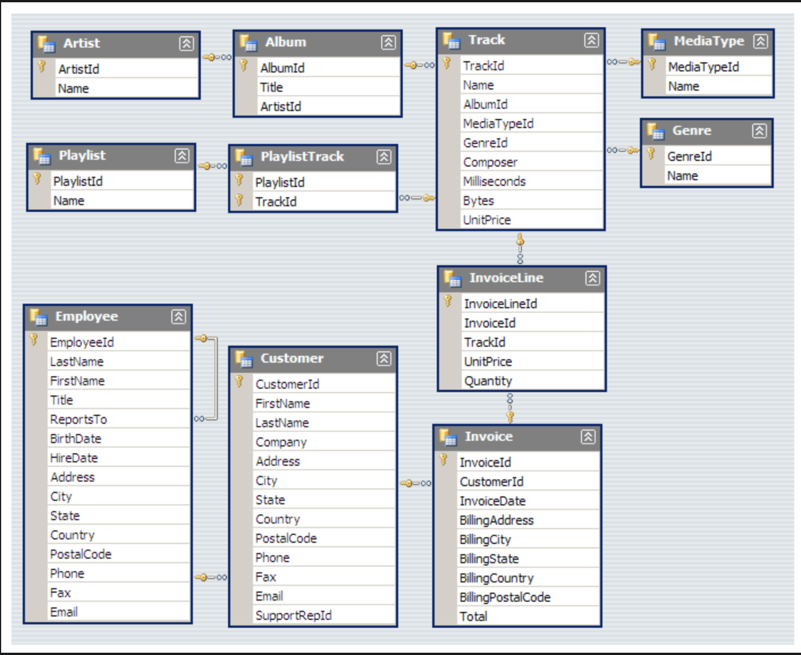

# sql-music-store-analysis
SQL project analyzing music store sales data to extract business insights
## Objectives
- Analyze customer purchasing behavior
- Identify top-performing genres and artists
- Evaluate revenue trends across cities

## Key Insights
- Top customers based on total spending
- Revenue generated by different cities
- Most popular music genres

## Skills Used
- SQL JOINs
- GROUP BY
- Aggregate functions (SUM, COUNT)

## Tools
- PostgreSQL

## Project Files
- music_store_database.sql → Database structure and data
- analysis_queries.sql → SQL queries for analysis
## Database Schema

